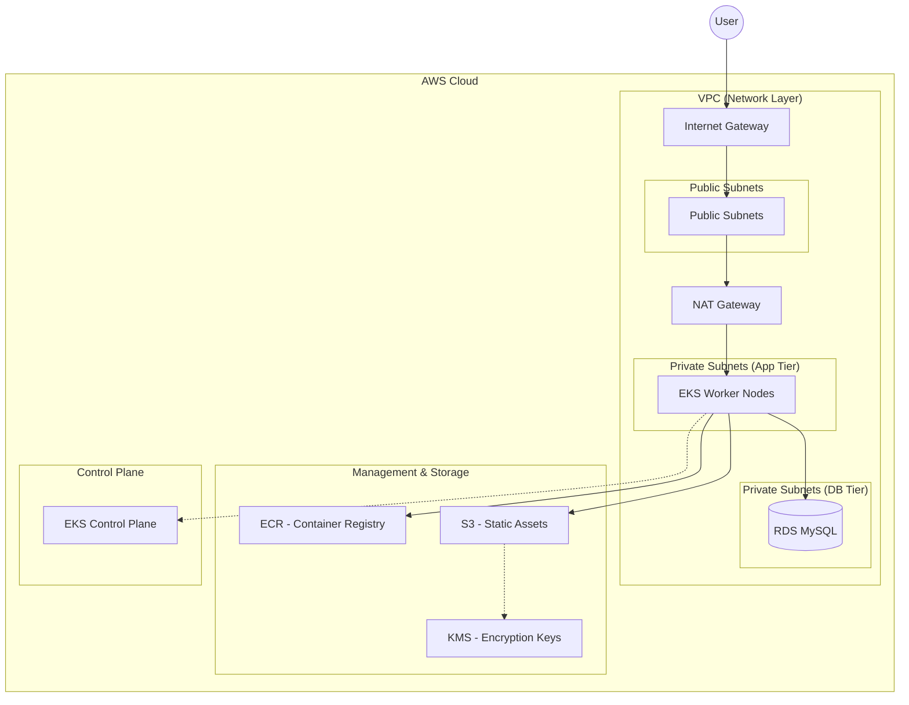
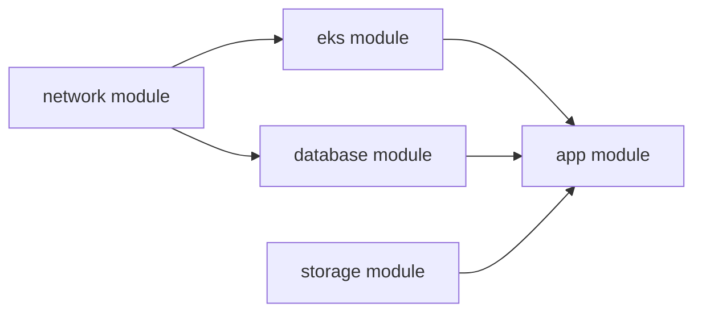

# 🏗️ 인프라 자동화 구성 (Terraform)

이 저장소는 컨테이너화된 애플리케이션을 실행하기 위해 고가용성 및 보안이 강화된 AWS 인프라를 프로비저닝하기 위한 Terraform 구성을 포함하고 있습니다.

## 🌐 아키텍처 개요

본 인프라는 보안, 확장성, 고가용성을 위해 계층화된 멀티 티어(Multi-tier) 설계를 따릅니다.

### 📊 시스템 아키텍처 시각화 (Mermaid)



### 🏗️ 계층별 구성 요소 설명
1.  **네트워크 계층 (Network Layer)**:
    - **Public Subnet**: NAT Gateway 및 외부 통신을 위한 게이트웨이가 위치합니다.
    - **Private Subnet (App)**: EKS 워커 노드가 위치하며, 인터넷으로부터 직접적인 접근을 차단합니다.
    - **Private Subnet (DB)**: RDS 데이터베이스를 위한 격리된 영역으로, 오직 애플리케이션 계층에서만 접근 가능합니다.
2.  **컴퓨팅 계층 (Compute Layer)**:
    - **Amazon EKS**: 컨테이너 오케스트레이션을 담당하며, Managed Node Group을 통해 자동 확장이 가능합니다.
3.  **데이터 계층 (Data Layer)**:
    - **Amazon RDS**: 격리된 서브넷 내에서 실행되는 관리형 MySQL 데이터베이스입니다.
4.  **스토리지 계층 (Storage Layer)**:
    - **Amazon S3**: 정적 자산 저장을 위한 보안 객체 스토리지 (KMS 암호화 적용).
    - **Amazon ECR**: 애플리케이션 Docker 이미지를 안전하게 관리하는 프라이빗 레지스트리.

---

## 📁 디렉토리 구조

```text
terraform/
├── main.tf                 # 루트 오케스트레이션 (모듈 호출 및 프로바이더 설정)
├── variables.tf            # 전역 환경 변수 및 구성 설정
├── outputs.tf              # 루트 레벨 인프라 출력값
└── modules/                # 재사용 가능한 인프라 모듈
    ├── network/            # VPC, 서브넷, NAT Gateway, 보안 그룹
    ├── eks/                # EKS 클러스터 및 관리형 노드 그룹
    ├── database/           # RDS MySQL 인스턴스 및 서브넷 그룹
    ├── storage/            # S3 버킷, ECR 레포지토리, KMS 키
    └── app/                # Kubernetes Deployment 및 Service (LoadBalancer)
```

---

## 🛠️ 모듈 상세 설명

### 1. `network` 모듈
인프라의 토대인 네트워크 환경을 구축합니다.
- **주요 리소스**: VPC, Internet Gateway, NAT Gateway, Subnets (Public/Private), Route Tables, Security Groups.
- **핵심 역할**: 리소스 격리 및 트래픽 흐름 제어.

### 2. `eks` 모듈
쿠버네티스 환경을 관리합니다.
- **주요 리소스**: EKS Cluster, IAM Roles (Cluster/Node), Managed Node Groups.
- **핵심 역할**: 확장 가능한 컨테이너 오케스트레이션 환경 제공.

### 3. `database` 모듈
데이터 지속성 계층을 관리합니다.
- **주요 리소스**: RDS MySQL Instance, DB Subnet Group, DB Security Groups.
- **핵심 역할**: 격리된 환경에서의 관리형 데이터베이스 제공.

### 4. `storage` 모듈
자산 및 이미지 저장소를 관리합니다.
- **주요 리소스**: S3 Buckets, ECR Repositories, KMS Keys.
- **핵심 역할**: 컨테이너 이미지 및 정적 데이터의 보안 저장.

### 5. `app` 모듈
애플리케이션 로직을 Kubernetes에 배포합니다.
- **주요 리소스**: Kubernetes Deployment, Kubernetes Service (LoadBalancer).
- **핵심 역할**: 컨테이너 기반 애플리케이션 실행 및 외부 노출.

---

## 🔗 의존성 맵 (Dependency Map)

리소스 생성 순서 및 모듈 간 관계는 다음과 같습니다:



1.  **Network (Root)**: 모든 모듈의 기초가 되며 가장 먼저 생성됩니다.
2.  **EKS & Database**: Network에서 생성된 VPC ID 및 Subnet ID를 전달받아 생성됩니다.
3.  **Storage**: 독립적으로 구성되지만 애플리케이션에 필요한 정보를 제공합니다.
4.  **App (Leaf)**: 모든 인프라 구성 요소(EKS, DB, Storage)의 결과물을 사용하여 최종적으로 배포됩니다.

---

## 🚀 시작하기

### 📋 사전 요구 사항
- [Terraform](https://www.terraform.io/downloads.html) (>= 1.0.0)
- [AWS CLI](https://aws.amazon.com/cli/) (적절한 권한으로 설정 완료된 상태)

### ⚙️ 배포 단계

1. **Terraform 초기화**
   ```bash
   terraform init
   ```

2. **실행 계획 확인**
   ```bash
   # db_admin_password는 환경 변수나 CLI 인자로 전달해야 합니다.
   terraform plan -var="db_admin_password=<your_secure_password>"
   ```

3. **인프라 적용**
   ```bash
   terraform apply -var="db_admin_password=<your_secure_password>"
   ```

> [!WARNING]
> **보안 주의사항**: `db_admin_password`와 같은 민감한 정보는 절대로 `.tf` 파일에 직접 작성하지 마십시오. 반드시 환경 변수 또는 CLI 인자를 통해 전달해야 합니다.
